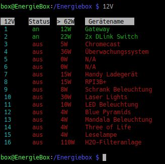

# 12V Steuerprogramm

Dieses Programm schaltet maximal 16 Eltakos für 12Volt Stromkreise.
Die Stromstärke beträgt derzeit 90 Ampere bei 12 Volt (1080 Watt).
Beim Einschalten eines Gerätes wird geprüft, ob die Notwendige 
angefragte Last verfügbar ist um Überlasten abzufangen.
Ein Timer zum schalten sowie eine Benutzerfreundliche Konfiguration
der Endverbraucher ist ebenfalls implementiert!
 
 
Die Eingabe des Befehls `12V` zeigt eine Liste an:  

 
    

  
Falls ein Relais Status (0 oder 1) von einem Relais von einem
anderem Programm ausgelesen werden muss, kann dieser Wert z.B. 
über den Pipe oder >> Oberator übergeben werden:
  

 
    

Der Status des Relais ist nun in der Datei status.txt gespeichert!
