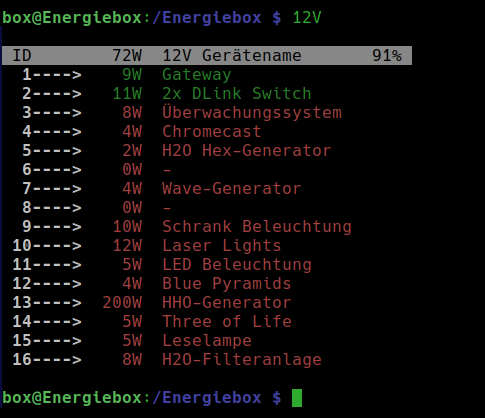
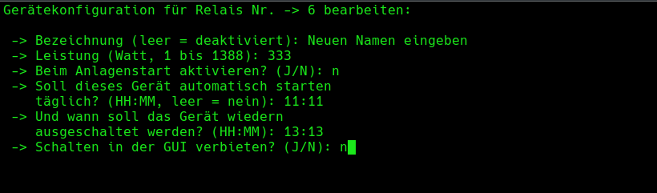
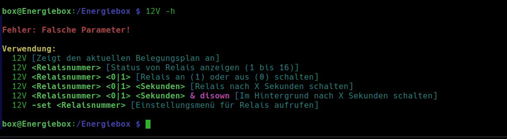

# 12V Steuerprogramm

Dieses Programm schaltet maximal 16 Eltakos für 12Volt Stromkreise.
Die Stromstärke beträgt derzeit 90 Ampere bei 12 Volt (1080 Watt).
Beim Einschalten eines Gerätes wird geprüft, ob die Notwendige 
angefragte Last verfügbar ist um Überlasten abzufangen.
Ein Timer zum schalten sowie eine Benutzerfreundliche Konfiguration
der Endverbraucher ist ebenfalls implementiert!
 
 
Die Eingabe des Befehls `12V` zeigt eine Liste an:  

 
    

  
Falls ein Relais Status (0 oder 1) von einem Relais von einem
anderem Programm ausgelesen werden muss, kann dieser Wert z.B. 
über den | oder >> Operator übergeben werden:
  

 
    

 
Der Status des Relais ist nun in der Datei status.txt gespeichert!
Falls ein Relais geschaltet werden soll, so kann das mit dem Befehl  
<code>12V 4 1</code> bewerkstelligt werden. Die 4 steht für die Relais Nummer und die
1 für den gewünschten Zustand (Möglich: 0/1). Nach dem absetzen des Befehls wird wieder die Liste angezeigt!
  

 
    

 
 
Um ein Relais von einer Zeitschaltuhr steuern zu lassem, kann der Befehl <code>12V 4 0 300 & disown</code> verwendet 
werden. In diesem Beispiel würde das Relais Nr. 4 ausgeschaltet werden nach 300 Sekunden. Die Parameter <code>& disown</code>
können verwendet werden damit die Konsole wieder sofort verfügbar ist.
  

 
    

  
Wenn ein Relais Eintrag verändert werden soll, z.B. Name, Leistungsaufnahme oder Automatisches Einschalten beim Starten,
dann kann der Befehl <code>12V -set 5</code> verwendet werden. Hier würde jetzt das Relais Nr. 5 bearbeitet werden!
  

 
    

  
Eine kleine Hilfe gibt es auch. Ungültige Parameterübergabe oder das Aufrufen von <code>12V -h</code> lässt die Hilfe erscheinen!
  

 
    

  

hgh
  

 
    

 

