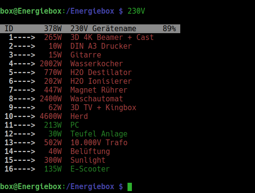
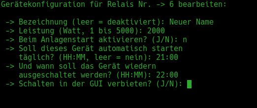
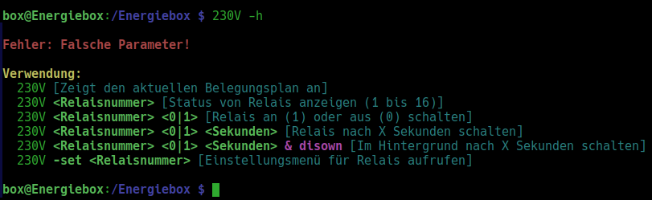
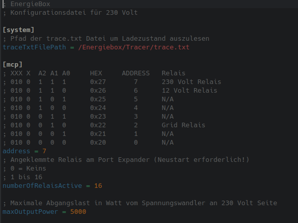

# 230V Steuerprogramm

Dieses Programm schaltet maximal 16 Eltakos für 12 Volt Stromkreise.
Die Stromstärke beträgt derzeit 60 Ampere bei 12 Volt (720 Watt).
Beim Einschalten eines Gerätes wird geprüft, ob die Notwendige 
angefragte Last verfügbar ist um Überlasten abzufangen.
Ein Timer zum schalten sowie eine Benutzerfreundliche Konfiguration
der Endverbraucher ist ebenfalls implementiert!
 
 
Listenansicht mit dem Befehl: `12V`  

 
    

  

Falls ein Relais Status (0 oder 1) von einem Relais von einem
anderem Programm ausgelesen werden muss, kann dieser Wert z.B. 
über den >> Operator übergeben werden:
  

 
    

 

Der Status des Relais ist nun in der Datei status.txt gespeichert!
Falls ein Relais geschaltet werden soll, so kann das mit dem Befehl  
<code>230V 4 1</code> bewerkstelligt werden. Die 4 steht für die Relais ID und die
1 für den gewünschten Zustand (Möglich: 0/1). Nach dem absetzen des Befehls wird wieder die Liste angezeigt!
  

 
    

 

Möchte man dagegen das Relais 4 einschalten ohne das eine Ausgabe angezeigt wird, dann kann der Befehl
<code>230V 4 1 0</code> ausgeführt werden!
  

 
    

 

Um ein Relais einmalig per Befehl von einer Zeitschaltuhr steuern zu lassen, kann der Befehl <code>230V 4 0 300 & disown</code> verwendet 
werden. In diesem Beispiel würde das Relais mit der ID 4 ausgeschaltet werden nach 300 Sekunden. Die Parameter <code>& disown</code>
können verwendet werden damit die Konsole wieder sofort verfügbar ist.
  

 
    

 

Wenn ein Relais Eintrag verändert werden soll, z.B. Name, Leistungsaufnahme oder Automatisches Einschalten beim Starten
der Anlage oder eine tägliche Zeitschaltung, dann kann der Befehl <code>230V -set 6</code> verwendet werden. 
Hier würde jetzt das Relais mit der ID 6 bearbeitet werden! Wenn der Name leer gelassen wird, werden alle Werte gelöscht.
  

 
    

 

Eine kleine Hilfe gibt es auch. Ungültige Parameterübergabe oder das Aufrufen von <code>230V -h</code> lässt die Hilfe erscheinen!
  

 
    

 

Falls Programm Variablen angepasst werden müssen, kann das über <code>nano /Energiebox/230V/config.ini</code> realisiert werden.
In dieser Datei muss der Hexadezimalwert als Adresse vom Port Expander vergeben werden. Dieser setzt sich zusammen aus der
gesetzten Jumper Konfiguration auf dem Expander selber. Jede Adresse darf nur einmal pro I²C Kanal vergeben sein.
Für maxOutputPower muss die Maximale Ausgangsleistung des Inverters in Watt angegeben werden.
  

 
    

 

