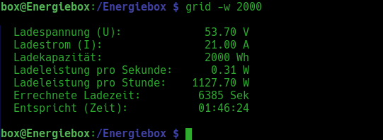
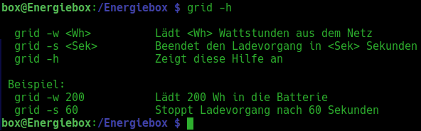
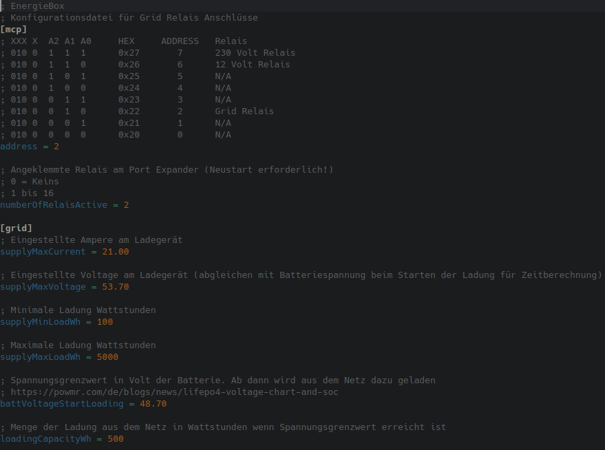

# grid Festnetz Batterie- Ladeprogramm

Dieses Programm lädt die Batterien bei Bedarf mit Energie aus dem Festnetz auf.
Hierzu wird zuerst das Ladegerät per Relais mit dem Festnetz verbunden und nach 5 Sekunden wird ein 
weiteres 80 Ampere Relais geschaltet welches die Verbindung zwischen Ladegerät und Batterie herstellt!
---
 
Zum Ladestart muss dem Programm über den Parameter <code>-w</code> eine Wattstunden Zahl übergeben
werden. Sobald diese Energie geladen worden ist, schaltet es sich selbstständig wieder ab.
 
 
Die Eingabe des Befehls <code>grid -w 200</code> startet das Programm und lädt 200 Wattstunden in die Batterie!

 

 
    

Damit diese Berechnungen zutreffend sind, müssen in der <code>/Energiebox/Grid/config.ini</code> Datei die Variablen 
angepasst werden an die verfügbare Ladeleistung!
  
<ul>
    <li>supplyMaxCurrent - Eingestellte Ampere am Ladegerät</li>
    <li>supplyMaxVoltage - Angezeigte Spannung am Ladegerät beim Ladestart</li>
    <li>battVoltageStartLoading - Batteriespannung wenn Ladegerät starten soll</li>
</ul>
 
Das Programm berechnet aus diesen Daten die Ladezeit in Sekunden!

 

 
 
Die Eingabe des Befehls <code>grid -s 50 & disown</code> beendet das Programm in 50 Sekunden und gibt die Konsole frei!
  

 
    

  

Eine kleine Hilfe gibt es auch. Ungültige Parameterübergabe oder das Aufrufen von <code>grid -h</code> lässt die Hilfe erscheinen!
  

 
    

 

Falls Programm Variablen angepasst werden müssen, kann das über <code>nano /Energiebox/Grid/config.ini</code> realisiert werden.
In dieser Datei muss der Hexadezimalwert als Adresse vom Port Expander vergeben werden. Dieser setzt sich zusammen aus der
gesetzten Jumper Konfiguration auf dem Expander selber. Jede Adresse darf nur einmal pro I²C Kanal vergeben sein.
  

 
    

 
