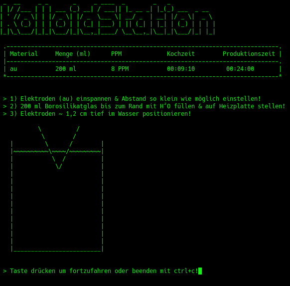
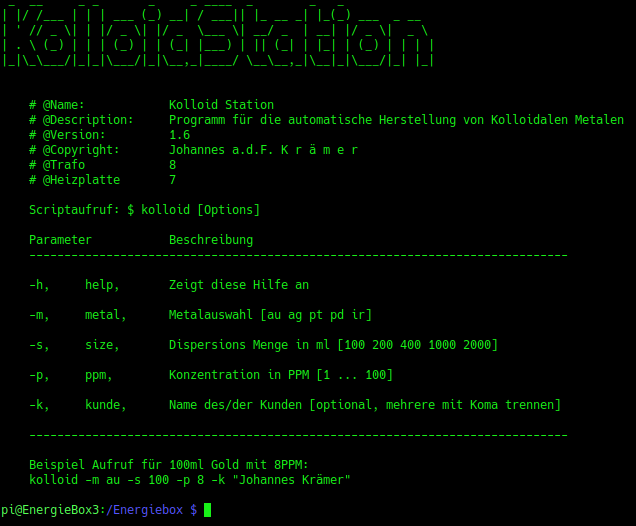

@Copyright by Johannes a.d.F. K r ä m e r

Was macht dieses Programm?

Mit diesem Programm können Kolloidale Metalle hergestellt werden. 
Die Ordnungsgemäße Funktion setzt vorraus, dass ein Magnetrührer oder eine 
Heizplatte sowie ein Hochspannungstrafo an der EnergieBox angeschlossen ist.

Weitere Informationen zu Kolloidalen Metallen auf <a href="https://kolloidalesgoldkaufen.de">kolloidalesgoldkaufen.de</a>

 
    

Nachdem das Programm mit dem Befehl kolloid auf der Kommandozeile aufgerufen wird,
werden spezifische Daten abgefragt. Zuerst wird gewählt um welches Metall es sich handelt.
Danach wird die Produktionsmenge ausgewählt und danach die Konzentration des Metalls in der Dispersion.
Der vierte Abfragewert ist optional und es kann ein Name für einen Kunden eingegeben werden. Dies dient
zur Statistikerstellung.

Nachdem diese Daten eingegeben worden sind, werden die Produktionsdaten nochmal zur Kontrolle angezeigt.
Das Programm zeigt ebenfalls die Elektrodeneinstellung an.
Wenn diese dann wie gewünscht eingegeben worden sind, wird der Vorgang mit Enter gestartet.

 
    

Nach der Bestätigung wird der Aufwärmprozess gestartet. Hier wird lediglich die Herzustellende Dispersion auf 86°C erhitzt.

 
    

Nachdem dies geschehen ist, wird automatisch der 10.000 Volt Trafo eingeschaltet um einen Plasma Blitz zwischen den Elektroden zu erzeugen.
Dadurch wird das gewählte Metall brachial abgesprengt und in nanometer kleinen Partikeln in die Flüssigkeit übertragen.

 
    

Je nach gewählten Parametern wird der Benutzer aufgefordert, die Elektroden neu zu justieren.
Bei dem Programmaufruf können die gewünschten Einstellungen auch direkt per Kommandozeilenparameter übergeben werden.
Hierzu einfach mal die Hilfe aufrufen mit:

kolloid -h

 
    

