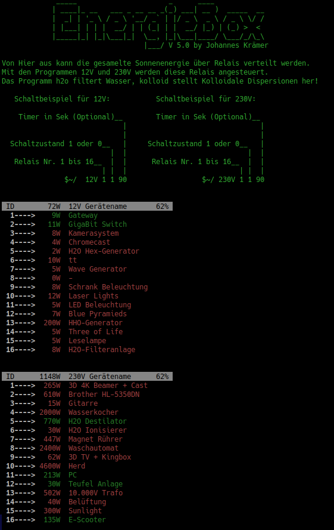
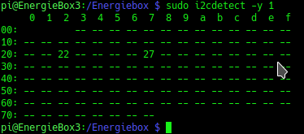

# ENERGIEBOX Ver. 4 für Raspberry PI 4 32Bit

### @Copyright 2023 by Johannes a.d.F. K r ä m e r

> Diese Software ist konzipiert für einen Raspberry Pi 4 32Bit der verbunden ist mit 2 Port Expandern die
jeweils 16 Relais steuern. Diese sollten dann starke Eltako Lastenstromstoßrelais steuern.
Als Spannungsquelle ist eine Photovoltaik Anlage mit einem 15 KW Speicher angeschlossen. Die 
Software beinhaltet ausserdem noch ein Programm zur Wasserfilterung sowie ein Programm zur Kolloid Herstellung.
Die Programme 12V und 230V schalten die Stromkreise an/aus und prüfen dabei die maximale Belastung.

 
    

> Es wird davon ausgegangen, dass bereits ein funktionierendes Raspberry OS 32Bit läuft und
2 MCP23017 (WAVESHARE, Artikelnummer BO-MCP23017) auf den Adressen 0x22 und 0x27 mit 
16 fach Relaisplatinen verbunden sind und an Eltakos für Lastenschaltkriese installiert sind. 
Ein 7" Touchdisplay sollte ebenfalls angeschlossen und eingerichtet sein. 

## Installationsanweisung:

1) Installation benötigter Pakete & Energiebox
2) Raspi Konfiguration
3) Startup & Shutdown Service
4) PATH Variablen setzen
5) DynDNS Einrichtung für Mobile App Zugriff
6) Firewall einstellen
7) GPIO Zustände beim starten

-------------------------------------
Installation benötigter Pakete      |
-------------------------------------

Damit alles direkt funktioniert, starten wir zuerst mit der nachträglichen Installation verschiedener benötigter Pakete:

`sudo apt-get update && sudo apt-get upgrade -y && sudo apt-get install uwf python-dev python3-pip git manpages-de ufw kate krusader mat hwinfo -y && sudo pip install rpi.gpio libgtk-3-dev xterm`

-------------------------------------
Installation Energiebox             |
-------------------------------------

Die Energiebox können Sie per ZIP Download herunterladen und sollte unbedingt nach /Energiebox kopieren werden
oder Sie installieren es bequem mit git clone direkt an die richtige Stelle:
 
`sudo git clone https://github.com/Blade83x2/EnergieBox.git /Energiebox && sudo chmod -R 755 /Energiebox && cd /Energiebox/WiringPi && sudo ./build && cd .. && cd /Energiebox/230V && sudo make && cd /Energiebox/12V && sudo make && cd /Energiebox/h2o && sudo make && cd /Energiebox/Shutdown && sudo make && cd /Energiebox/Startup && sudo make`

Mit den folgenden Zeilen werden die Berechtigungen auf die Dateien und Ordner gesetzt:

`sudo chmod 777 /Energiebox/12V/ && sudo chmod 755 /Energiebox/12V/12V && sudo chmod 755 /Energiebox/12V/12V.c && sudo chmod 766 /Energiebox/12V/12V.o && sudo chmod 666 /Energiebox/12V/config.ini && sudo chmod 744 /Energiebox/12V/Makefile && sudo chmod 755 /Energiebox/12V/mymcp23017.c && sudo chmod 755 /Energiebox/12V/mymcp23017.h && sudo chmod 755 /Energiebox/12V/mymcp23017.o && sudo chmod 755 /Energiebox/12V/setConfig.sh && sudo chmod 755 /Energiebox/12V/setIni.sh`

`sudo chmod 777 /Energiebox/230V/ && sudo chmod 755 /Energiebox/230V/230V && sudo chmod 755 /Energiebox/230V/230V.c && sudo chmod 766 /Energiebox/230V/230V.o && sudo chmod 666 /Energiebox/230V/config.ini && sudo chmod 744 /Energiebox/230V/Makefile && sudo chmod 755 /Energiebox/230V/mymcp23017.c && sudo chmod 755 /Energiebox/230V/mymcp23017.h && sudo chmod 755 /Energiebox/230V/mymcp23017.o && sudo chmod 755 /Energiebox/230V/setConfig.sh && sudo chmod 755 /Energiebox/230V/setIni.sh` 

`sudo chmod 777 /Energiebox/h2o/ && sudo chmod 666 /Energiebox/h2o/config.ini && sudo chmod 755 /Energiebox/h2o/h2o && sudo chmod 755 /Energiebox/h2o/setIni.sh && sudo chmod 755 /Energiebox/h2o/h2o.c && sudo chmod 755 /Energiebox/h2o/h2o.o  && sudo chmod 744 /Energiebox/h2o/Makefile`

`sudo chmod 777 /Energiebox/img/ && sudo chmod 777 /Energiebox/Kolloid/ && sudo chmod 777 /Energiebox/gui/`

 
-------------------------------------
Raspi Konfiguration                 |
-------------------------------------

Den User pi bei Systembefehlen zum Passwort zwingen

`sudo nano /etc/sudoers.d/010_pi-nopasswd`

Nun ändern wir:

`pi ALL=(ALL) NOPASSWD: ALL`

zu 

`pi ALL=(ALL) PASSWD: ALL`

Danach wählen wir einen anderen Benutzernamen um die Sicherheit zu erhöhen. Hierfür geben wird

`sudo rename-user`

ein und starten den Raspberry dann neu. Nach dem Hochfahren kommt eine Grafische Oberfläche wo der
Benutzer geändert werden kann. Wir haben uns für den Benutzer `box` entschieden!

Als nächstes wird der Raspberry konfiguriert damit die Hardware entsprechend zusammen Arbeiten kann.
WLAN sowie Bluetooth werden ausgeschaltet und das System bekommt einen festen Kabelanschluss für die
Internet Verbindung damit Sie die Eltakos über das Internet steuern können. Hierzu wird der Befehl

`sudo nano /boot/config.txt`

vom Terminal aus aufgerufen und in der Datei folgendes auskommentieren:

`dtoverlay=w1-gpio`

`dtoverlay=disable-wifi`

`dtoverlay=disable-bt`

Mit dem drücken der Tastenkombination Strg + x kann die Änderung gespeichert werden.
Danach wird die Raspberry Konfiguration aufgerufen mit dem Befehl

`sudo raspi-config`

Zuerst gehen wir in Interfacing Options rein und aktivieren dort den Service SSH und bestätigen das.
Anschliessend gehen wir wieder in Interfacing Options rein und aktivieren noch den Service I2C sowie SPI auf
die Gleiche Weise. Nun gehen wir in das Menu Network Options unter Hostname und vergeben dort den
Namen EnergieBox.

Danach gehen wir in System Options -> Boot / Autologin rein und wählen dort Desktop Autologin aus.

Nun wählen wir das Menü Performance -> GPU Memory aus. Hier tippen wir den Wert 256 ein und bestätigen
dies mit einem Klick auf OK. 

Als letztes den Serial Port einschalten fürs Auslesen der RS-485 Schnittstelle. Dazu im Menu Interface Options den Serial Port auswählen.
Bei der Frage ob eine Login Shell aktiviert werden soll, No/Nein wählen und bei der nächsten Frage ob der Serial Port eingeschaltet werden soll
Yes/Ja wählen.

Da wir nun fertig sind wählen wir als letztes Finish aus dem Hauptmenu
und starten den Raspberry mit sudo reboot neu um die Einstellungen zu übernehmen.

Nach dem Neustart öffnen wir wieder ein Terminal und setzen den Befehl

`sudo nano /etc/ssh/sshd_config`

ab. In dieser Datei stellen wir sicher das folgender Eintrag gesetzt ist:

`PrintLastLog no`

Dann suchen wir:

`PermitRootLogin without-password`

und ersetzen es mit: 

`PermitRootLogin yes`

Speichern können wir wieder mit der Tastenkombination Strg + x.

Der Benutzer root hat bislang kein Passwort. Dieses setzen wir mit

`sudo passwd root`

Nun Verändern wir das was gesehen wird nach dem SSH Login:

`sudo nano /etc/motd`

aufrufen und alles was in dieser Datei steht wird ersetzt mit:

                 _____                      _      ____
                | ____|_ __   ___ _ __ __ _(_) ___| __ )  _____  __
                |  _| | '_ \ / _ \ '__/ _` | |/ _ \  _ \ / _ \ \/ /
                | |___| | | |  __/ | | (_| | |  __/ |_) | (_) >  <
                |_____|_| |_|\___|_|  \__, |_|\___|____/ \___/_/\_\
                                      |___/ V 4.0 by Johannes Krämer

Von Hier aus kann die gesamelte Sonnenenergie über Relais verteilt werden.
Mit den Programmen 12V und 230V werden diese Relais angesteuert.
Das Programm h2o filtert Wasser, kolloid stellt Kolloidale Dispersionen her!

       Schaltbeispiel für 12V:           Schaltbeispiel für 230V:
        
        Timer in Sek (Optional)__        Timer in Sek (Optional)__
                                 |                                |
                                 |                                |
      Schaltzustand 1 oder 0__   |     Schaltzustand 1 oder 0__   |
                              |  |                             |  |
       Relais Nr. 1 bis 16__  |  |      Relais Nr. 1 bis 16__  |  |
                            | |  |                           | |  |
                   $~/  12V 1 1 90                  $~/ 230V 1 1 90       
     
Diese Änderung kann ebenfalls wieder mit der Tastenkombination 
Strg + x gespeichert werden. Nun tippen wir auf der Konsole den Befehl 

`sudo nano ~/.bashrc`

ein und fügen ganz unten am Ende der Datei folgendes ein:

`12V`

`230V`

Auch diese Aktion wird wieder mit Strg + x gespeichert.

Nun prüfen wir noch kurz, ob die beiden Port Expander (0x22 und 0x27) angezeigt werden unter dem Befehl:

`sudo i2cdetect -y 1`

Sollte das der Fall sein, sollte die Ausgabe so aussehen:

 
    

-------------------------------------
Startup & Shutdown Service          |
-------------------------------------  

Zwecks des Automatischen Einschalten von Stromkreisen (in config.ini einstellbar)
geben wir im Terminal den Befehl

`sudo nano /etc/rc.local`

ein und fügen ganz unten über exit 0 folgende Zeile ein:

`/Energiebox/Startup/mcp_startup`

Auch diese Aktion wird wieder mit Strg + x gespeichert.
Danach wird der Befehl

`sudo nano /etc/rc.shutdown`

eingegeben und in diese Datei wird folgendes rein kopiert:

`#!/bin/bash`

`/Energiebox/Shutdown/mcp_shutdown`

`exit 0`

Diese Aktion wird wieder mit Strg + x gespeichert.
Als nächstes wird der Befehl

`sudo nano /etc/systemd/system/rcshutdown.service`

in der Konsole abgesetzt und in diese Datei wird folgendes eingefügt:

`[Unit]`

`Description=/etc/rc.shutdown`

`Before=shutdown.target`

`[Service]`

`ExecStart=/bin/true`

`ExecStop=/etc/rc.shutdown`

`RemainAfterExit=yes`

`[Install]`

`WantedBy=multi-user.target`

Wie immer wird diese Aktion mit Strg + x gespeichert.
Um diesen Service einzuschalten, muss er noch aktiviert werden.
Dies geschieht mit folgendem Terminal Befehl:

`sudo systemctl enable rcshutdown.service`

----------

Wenn der Raspberry hoch gefahren wird, lassen wir eine Grafische Oberfläche starten damit per Tastendruck alles gesteuert werden kann.
Dieser Schritt muss für jeden Benutzer separat gemacht werden wenn das Programm gestartet werden soll beim booten.

Autostart Ordner erstellen (Zeigt Fehlermeldung wenn er bereits existiert)

`mkdir ~/.config/autostart`

Autostart Datei erstellen

`sudo nano ~/.config/autostart/energiebox-gui.desktop`

In diese Datei folgendes kopieren:

`[Desktop Entry]`
`Name=EnergieBox GUI`
`Comment=Grafische Oberfläche zum steuern der Relais`
`Type=Application`
`Exec=/Energiebox/gui/gui`
`Terminal=false`

Die Grafische Schnittstelle wird nun beim Starten geladen.

Um eine Virtuelle Tastatur auf dem Touchdisplay bei Berührung anzeigen zu lassen, installieren wir mit

`sudo apt-get install onboard && sudo apt-get install at-spi2-core`

die Entsprechenden Packete. Danach rufen wir über Startmenü > Preferences > Onboard Settings die
Einstellungen auf. Unter General den Hacken bei Auto-show when editing text sowie
Show when unlocking the screen setzen und speichern. Unter Window setzen wir Dock to screen edge.
Unter Auto-show Hacken setzem bei Auto-show when editing text.
Unter Layout wird Small gewählt und unter Theme DarkRoom. Zuletzt alles speichern.
Die Tastatur muss nach jedem Start aktiviert werden unter Startmenü >Universal Access > Onboard

-------------------------------------
PATH Variablen                      |
-------------------------------------  

Nun bearbeiten wir noch die PATH Variablen. Dies dient dazu,
das alle Programme die im Ordner /Energiebox/* gespeichert sind
von überall zugänglich sind. Dazu öffnen wir wieder ein Terminal
und tippen den folgenden Befehl ein:

`sudo nano /etc/bash.bashrc`

am Ende fügen wir die 4 Zeilen hinzu und speichern diese danach
wieder ab mit Strg + x:

`PATH=$PATH:/Energiebox/12V`

`PATH=$PATH:/Energiebox/230V`

`PATH=$PATH:/Energiebox/Kolloid`

`PATH=$PATH:/Energiebox/h2o`

`PATH=$PATH:/Energiebox/gui`

-------------------------------------
IP Setup & DynDNS Einrichtung       |
-------------------------------------  

IP Einstellungen aufrufen mit:

`sudo nano /etc/dhcpcd.conf`

und dort folgendes eintragen(vorher abändern)

`interface eth0`
`static ip_address=10.0.0.2/24`
`static ip6_address=29c5:ef1d:3023:5c04::ff/64`
`static routers=10.0.0.1`
`static domain_name_servers=10.0.0.1 8.8.8.8 29c5:ef1d:3023:5c04::1`

und mit Strg + x abspeichern. Nun sollte der Rechner Neugestartet werden mit

`sudo reboot`

Im Router/Gateway wurde der Port 2222 freigegeben und intern auf Port 22 des Raspbbery umgeleitet

Nun erstellen wir noch ein SSH Key auf dem Rechner der eine Verbindung zum Raspberry Pi4 aufbaut:

`ssh-keygen -t rsa`

Als Eingabe lassen wir alles leer und drücken einfach nur Enter.

Die erzeugten Keys können jetzt angezeigt werden mit:

`ls -l .ssh/`

Um diesen Key mit dem Raspberry zu Verbinden folgendes Ausführen:
(Port, Username & DynDNS entsprechend anpassen!)

`ssh-copy-id -p 2222 pi@home.cplusplus-development.de`

-------------------------------------
Firewall einstellen                 |
-------------------------------------

Den Port 22 geben wir mit der UFW Firewall frei während wir alles andere sperren.
Hierzu muss auf der Konsole der Befehl abgesetzt werden:

`sudo ufw allow ssh/tcp && sudo ufw limit ssh/tcp && sudo ufw logging on && sudo ufw enable`

Zusätzlich installieren wir noch fail2ban

`sudo apt-get install fail2ban && cd /etc/fail2ban`

Zum Konfigurieren kopieren wir eine Vorgegebene Datei und verändern die Kopie

`sudo cp jail.conf jail.local && sudo nano jail.local`

[sshd] suchen und darunter 

`enabled = true`

einfügen. Danach speichern.

`sudo systemctl enable fail2ban && sudo systemctl start fail2ban`

Testen: Wenn falsche Daten bei einer SSH Verbindung eingegeben worden sind, zeigt fail2ban
nicht mehr "Permission denied" sondern "Connection refused" an!

Automatische Sicherheitsupdates installieren

`sudo dpkg-reconfigure --priority=low unattended-upgrades`

Im neuen Fenster Ja wählen

-------------------------------------
GPIO Zustände                       |
-------------------------------------  

Da wir in der Energiebox 32 Kanäle und somit 32 Stromkreise schalten, haben wir
uns natürlich für PortExpander entschieden die über I2C verbunden sind.
Falls es jedoch mal notwendig sein sollte, einen einzelnen GPIO Kanal zu schalten, der 
hat hier ein Beispiel für das Setzen der GPIO Direction (in/out) sowie für den Wert (nur bei out):

`sudo nano /etc/rc.local`
                   
`sleep 0.1`

`echo "20" > /sys/class/gpio/export`

`sleep 0.1`

`echo "out" > /sys/class/gpio/gpio20/direction`

`echo "1" > /sys/class/gpio/gpio20/value`
