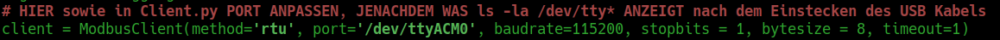

# ENERGIEBOX Ver. 5 für Raspberry PI 4 32Bit

### @Copyright 2023 by Johannes a.d.F. K r ä m e r

> Diese Software ist konzipiert für einen Raspberry Pi 4 32Bit der verbunden ist mit 3 Port Expandern an
denen insgesamt 34 Relais angeschlossen sind. Diese sollten dann starke Eltako Lastenstromstoßrelais steuern.
Als Spannungsquelle ist eine Photovoltaik Anlage mit einem 5 KW Speicher angeschlossen. Die 
Software beinhaltet ausserdem noch ein Programm zur Wasserfilterung sowie ein Programm zur Kolloid Herstellung.
Die Programme 12V und 230V schalten die Stromkreise an/aus und prüfen dabei die maximale Belastung.

 
    

> Es wird davon ausgegangen, dass bereits ein funktionierendes Raspberry OS 32Bit läuft und
3 MCP23017 (WAVESHARE, Artikelnummer BO-MCP23017) auf den Adressen 0x22, 0x26 und 0x27 mit 
16 fach Relaisplatinen verbunden sind und an Eltakos für Lastenschaltkriese installiert sind. 
Ein 7" Touchdisplay sollte ebenfalls angeschlossen und eingerichtet sein. 

## Installationsanweisung:

1) Installation benötigter Pakete & Energiebox

2) Raspi Konfiguration

3) Startup & Shutdown Service

4) PATH Variablen setzen

5) DynDNS Einrichtung für Mobile App Zugriff

6) Firewall einstellen

7) HTTP, HTTPS, MySQL + PHPmyAdmin installation

-------------------------------------
Installation benötigter Pakete      |
-------------------------------------

Damit alles direkt funktioniert, starten wir zuerst mit der nachträglichen Installation verschiedener benötigter Pakete:

`sudo apt-get update && sudo apt-get upgrade -y && sudo apt-get install build-essential libgtk-3-dev ufw python3-dev python3-pip git manpages-de ufw kate krusader mat hwinfo apt install mariadb-server libmariadb-dev-compat libmariadb-dev fonts-noto-color-emoji libgtk-3-dev xterm libgtkmm-3.0-dev iputils-ping clang-format figlet -y`

Sowie:

`sudo pip install rpi.gpio pymodbus`

-------------------------------------
Installation Energiebox             |
-------------------------------------

Zuerst wird dem Benutzer root ein Passwort vergeben. Dieses setzen wir mit:

`sudo passwd root`

Danach wählen wir einen anderen Benutzernamen für den Standart User pi um die Sicherheit zu erhöhen. Hierfür geben wir

`sudo rename-user`

ein und starten den Raspberry danach neu. Nach dem Neustart kommt eine Grafische Oberfläche wo der
Benutzer geändert werden kann. Wir haben uns für den Benutzer `box` entschieden!
Nun ist der Raspberry bereit für die Installation der Software!

Die Energiebox kann per git clone direkt an die richtige Stelle installiert werden:
 
`sudo git clone https://github.com/Blade83x2/EnergieBox.git /Energiebox && sudo chmod -R 770 /Energiebox`

Zunächst erstellen wir die Gruppe energiebox und weisen diese dem Hauptverzeichnis zu:

`sudo groupadd energiebox && sudo chgrp -R energiebox /Energiebox`

Danach werden die 2 Benuter root sowie box dieser Gruppe hinzugefügt:

`sudo usermod -aG energiebox root && sudo usermod -aG energiebox box && newgrp energiebox`

Als nächstes wird das Script für die Datei & Ordnerberechtigung ausgeführt. Es wird während dem Ablauf das root Passwort abgefragt!

`cd /Energiebox/System && sudo chmod u+x setup_permissions.sh && bash setup_permissions.sh`

Projekt Daten kompilieren:

`cd /Energiebox/WiringPi && sudo ./build && cd .. && sudo ./build.sh`

Danach wird die MySQL Datenbank die gerade installiert worden ist, abgesichert. Hierzu den folgenden Befehl verwenden:

`sudo mysql_secure_installation`

Es muss ein Root Passwort vergeben werden. Dann den anonymous User löschen sowie den Remote Login für root 
deaktivieren und die test Datenbank löschen. Anschliessend noch die Privilegien neu laden.

Mit dem folgenden Befehl wird eine Datei ausgeführt, die die Berechtigungen für die Ordner und Dateien festlegt:

`sudo /Energiebox/System/setup_permissions.sh`

Als nächstes wird die Datenbank eingerichtet für die Energiebox. Diese ist dafür notwendig um MPPT Daten 
sowie Netzladungen zu protokollieren. Hierzu folgendes Script aufrufen und den Anweisungen folgen:

`sudo /Energiebox/System/setup_db.sh`

Nach dem Datenbank Setup kann geprüft werden ob sie mit den Daten erreichbar ist. Natürlich gibt es noch keine Einträge in der Datenbank!

`watch -n 1 "sudo mysql --defaults-file=/home/$(whoami)/.mysql_energiebox.cfg -e \"SELECT * FROM messwerte;\" energiebox"`

-------------------------------------
Raspi Konfiguration                 |
-------------------------------------

Den User pi bei Systembefehlen zum Passwort zwingen

`sudo nano /etc/sudoers.d/010_pi-nopasswd`

Nun ändern wir:

`pi ALL=(ALL) NOPASSWD: ALL`

zu 

`pi ALL=(ALL) PASSWD: ALL`

Als nächstes wird der Raspberry konfiguriert damit die Hardware entsprechend zusammen Arbeiten kann.
WLAN sowie Bluetooth werden ausgeschaltet und das System bekommt einen festen Kabelanschluss für die
Internet Verbindung damit Sie die Eltakos über das Internet steuern können. Hierzu wird der Befehl

`sudo nano /boot/config.txt`

vom Terminal aus aufgerufen und in der Datei folgendes auskommentieren:

`dtoverlay=w1-gpio`

`dtoverlay=disable-wifi`

`dtoverlay=disable-bt`

Mit dem drücken der Tastenkombination Strg + x kann die Änderung gespeichert werden.
Danach wird die Raspberry Konfiguration aufgerufen mit dem Befehl

`sudo raspi-config`

Zuerst gehen wir in Interfacing Options rein und aktivieren dort den Service SSH und bestätigen das.
Anschliessend gehen wir wieder in Interfacing Options rein und aktivieren noch den Service I2C sowie SPI auf
die Gleiche Weise. Nun gehen wir in das Menu Network Options unter Hostname und vergeben dort den
Namen EnergieBox.

Danach gehen wir in System Options -> Boot / Autologin rein und wählen dort Desktop Autologin aus.

Nun wählen wir das Menü Performance -> GPU Memory aus. Hier tippen wir den Wert 256 ein und bestätigen
dies mit einem Klick auf OK. 

Als letztes den Serial Port einschalten fürs Auslesen der RS-485 Schnittstelle. Dazu im Menu Interface Options den Serial Port auswählen.
Bei der Frage ob eine Login Shell aktiviert werden soll, No/Nein wählen und bei der nächsten Frage ob der Serial Port eingeschaltet werden soll
Yes/Ja wählen.

Da wir nun fertig sind wählen wir als letztes Finish aus dem Hauptmenu
und starten den Raspberry mit sudo reboot neu um die Einstellungen zu übernehmen.

Nach dem Neustart öffnen wir wieder ein Terminal und setzen den Befehl

`sudo nano /etc/ssh/sshd_config`

ab. In dieser Datei stellen wir sicher das folgender Eintrag gesetzt ist:

`PrintLastLog no`

Dann suchen wir:

`PermitRootLogin without-password`

und ersetzen es mit: 

`PermitRootLogin yes`

Dann suchen wir:

`#X11Forwarding no`

und ersetzen es mit: 

`X11Forwarding yes`

Speichern können wir wieder mit der Tastenkombination Strg + x.

Nun Verändern wir das was gesehen wird nach dem SSH Login:

`sudo nano /etc/motd`

aufrufen und alles was in dieser Datei steht wird ersetzt mit:

                 _____                      _      ____
                | ____|_ __   ___ _ __ __ _(_) ___| __ )  _____  __
                |  _| | '_ \ / _ \ '__/ _` | |/ _ \  _ \ / _ \ \/ /
                | |___| | | |  __/ | | (_| | |  __/ |_) | (_) >  <
                |_____|_| |_|\___|_|  \__, |_|\___|____/ \___/_/\_\
                                      |___/ V 5.0 by Johannes Krämer

Von Hier aus kann die gesamelte Sonnenenergie über Relais verteilt werden.
Mit den Programmen 12V und 230V werden diese Relais angesteuert.
Das Programm h2o filtert Wasser, kolloid stellt Kolloidale Dispersionen her!

       Schaltbeispiel für 12V:           Schaltbeispiel für 230V:
        
        Timer in Sek (Optional)__        Timer in Sek (Optional)__
                                 |                                |
                                 |                                |
      Schaltzustand 1 oder 0__   |     Schaltzustand 1 oder 0__   |
                              |  |                             |  |
       Relais Nr. 1 bis 16__  |  |      Relais Nr. 1 bis 16__  |  |
                            | |  |                           | |  |
                   ~/$  12V 1 1 90                  ~/$ 230V 1 1 90       
     
Diese Änderung kann ebenfalls wieder mit der Tastenkombination 
Strg + x gespeichert werden. Nun tippen wir auf der Konsole den Befehl 

`nano ~/.bashrc`

ein und fügen ganz unten am Ende der Datei folgendes ein:

`12V`

`230V`

`/Energiebox/System/check.sh`

`/Energiebox/Kolloid/shop`

Auch diese Aktion wird wieder mit Strg + x gespeichert.

Nun prüfen wir noch kurz, ob alle 3 Port Expander (0x22, 0x26 und 0x27) angezeigt werden unter dem Befehl:

`i2cdetect -y 1`

Sollte das der Fall sein, sollte die Ausgabe so aussehen:

 
    

Eine Übersicht der Belegung auf der Platine kann eingesehen werden mit:

`gpio -g readall`

Falls das Betriebssystem auf einer SD Karte im Raspberry läuft, empfiehlt es sich,
die Swap Funktion zu deaktivieren. Diese schreibt Daten aus dem RAM auf die SD Karte.
Mit dem Befehl

`sudo service dphys-swapfile status`

kann geschaut werden ob diese Funktion läuft. Mit 

`sudo service dphys-swapfile stop`

kann der Dienst angehalten werden und mit 

`free -m -t`

sieht man ob die Swap Datei wirklich leer ist. Vollständig deaktivieren 
kann man den Dienst mit 

`sudo systemctl disable dphys-swapfile`

-------------------------------------
Startup & Shutdown Service          |
-------------------------------------  

Zwecks des Automatischen Einschalten von Stromkreisen (in config.ini einstellbar)
geben wir im Terminal den Befehl

`sudo nano /etc/rc.local`

ein und fügen ganz unten über exit 0 folgende Zeile ein:

`/Energiebox/Startup/mcp_startup`

Auch diese Aktion wird wieder mit Strg + x gespeichert.
Danach wird der Befehl

`sudo nano /etc/rc.shutdown`

eingegeben und in diese Datei wird folgendes rein kopiert:

`#!/bin/bash`

`/Energiebox/Shutdown/mcp_shutdown`

`exit 0`

Diese Aktion wird wieder mit Strg + x gespeichert.
Nun geben wir dieser Datei noch Ausführungsrechte mit 

`sudo chmod +x /etc/rc.shutdown`

Als nächstes wird der Befehl

`sudo nano /etc/systemd/system/rcshutdown.service`

in der Konsole abgesetzt und in diese Datei wird folgendes eingefügt:

`[Unit]`

`Description=/etc/rc.shutdown`

`Before=shutdown.target`

`[Service]`

`ExecStart=/bin/true`

`ExecStop=/etc/rc.shutdown`

`RemainAfterExit=yes`

`[Install]`

`WantedBy=multi-user.target`

Wie immer wird diese Aktion mit Strg + x gespeichert.
Um diesen Service einzuschalten, muss er noch aktiviert werden.
Dies geschieht mit folgendem Terminal Befehl:

`sudo systemctl enable rcshutdown.service`

----------

Wenn der Raspberry hoch gefahren wird, lassen wir eine Grafische Oberfläche starten damit per Tastendruck alles gesteuert werden kann.
Dieser Schritt muss für jeden Benutzer separat gemacht werden wenn das Programm gestartet werden soll beim booten.

Autostart Ordner erstellen (Zeigt Fehlermeldung wenn er bereits existiert)

`mkdir ~/.config/autostart`

Autostart Datei erstellen

`sudo nano ~/.config/autostart/energiebox-gui.desktop`

In diese Datei folgendes kopieren:

`[Desktop Entry]`

`Name=EnergieBox GUI`

`Comment=Grafische Oberfläche zum steuern der Relais`

`Type=Application`

`Exec=/Energiebox/gui/gui`

`Terminal=false`

Die Grafische Schnittstelle wird nun beim Starten geladen.

----------

Als nächstes installieren wir 2 Cronjobs. Der eine ist dazu da, jede Minute zu prüfen ob
ein Gerät an oder aus geschaltet werden soll und der andere prüft jede 3 Minten die
Batteriespannung und schaltet falls notwendig das Netzladegerät an.

`sudo crontab -e`

Ganz unten fügen wir folgende Zeile hinzu:

`*/1 * * * * cd /Energiebox/Tracer && ./trace 2>> /Energiebox/error.log`

`* * * * * /Energiebox/System/autoStartStop.sh 2>> /Energiebox/error.log`

Der EP-EVER muss per RS-485 Adapter am USB Port des Raspberry's eingesteckt sein.
Im Python Script muss der verwendete USB Port eingetragen werden.  Um den Port zu ermitteln, kann die
Differenz des Befehls

`ls /dev/tty*`

genutzt werden. Ist der RS-485 Adapter eingesteckt, wird ein Eintrag zusätzlich angezeigt.
Bislang war es immer der Eintrag `/dev/ttyACM0`. Es kommt allerdings darauf an,
wieviele USB Geräte angeschlossen sind. Nachdem diese Port Adresse ausfindig gemacht worden ist,
muss diese im Script eingetragen werden. Hierzu folgenden Befehl aufrufen:

`cd /Energiebox/Tracer/ && sudo nano readall.py`

und in der Zeile 12 unter Port die Geräteadresse eintragen

 
    

Den gleichen Eintrag ebenfalls in die client.py in Zeile 15 hinzufügen

`cd pyepsolartracer && sudo nano client.py`

 
    

Zum Testen in der Konsole 

`python3 /Energiebox/Tracer/readall.py > /Energiebox/Tracer/trace.txt`

aufrufen. Mit 

`cat /Energiebox/Tracer/trace.txt`

sollten alle Ausgelesenen Daten angezeigt werden.

-------------------------------------
PATH Variablen                      |
-------------------------------------  

Nun bearbeiten wir noch die PATH Variablen. Dies dient dazu,
das alle Programme die im Ordner /Energiebox/* gespeichert sind
von überall zugänglich sind. Dazu öffnen wir wieder ein Terminal
und tippen den folgenden Befehl ein:

`sudo nano /etc/bash.bashrc`

am Ende fügen wir die 10 Zeilen hinzu und speichern diese danach
wieder ab mit Strg + x:

`PATH=$PATH:/Energiebox/12V`

`PATH=$PATH:/Energiebox/230V`

`PATH=$PATH:/Energiebox/Kolloid`

`PATH=$PATH:/Energiebox/h2o`

`PATH=$PATH:/Energiebox/gui`

`PATH=$PATH:/Energiebox/Grid`

-------------------------------------
IP Setup & DynDNS Einrichtung       |
-------------------------------------  

IP Einstellungen aufrufen mit:

`sudo nano /etc/dhcpcd.conf`

und dort folgendes eintragen(vorher abändern)

`interface eth0`

`static ip_address=10.0.0.2/24`

`static ip6_address=29c5:ef1d:3023:5c04::ff/64`

`static routers=10.0.0.1`

`static domain_name_servers=10.0.0.1 8.8.8.8 29c5:ef1d:3023:5c04::1`

und mit Strg + x abspeichern. Nun sollte der Rechner Neugestartet werden mit

`sudo reboot`

Im Router/Gateway sollte der Port 2222 freigegeben werden und intern auf Port 22 des Raspbbery umgeleitet werden.

Nun erstellen wir noch ein SSH Key auf dem Rechner der eine Verbindung zum Raspberry Pi4 aufbaut:

`ssh-keygen -t rsa`

Als Eingabe lassen wir alles leer und drücken einfach nur Enter.

Die erzeugten Keys können jetzt angezeigt werden mit:

`ls -l .ssh/`

Um diesen Key mit dem Raspberry zu Verbinden folgendes Ausführen:
(Port, Username & DynDNS entsprechend anpassen!)

`ssh-copy-id -p 2222 box@home.cplusplus-development.de`

-------------------------------------
Firewall einstellen                 |
-------------------------------------

Den Port 22 geben wir mit der UFW Firewall frei während wir alles andere sperren.
Hierzu muss auf der Konsole der Befehl abgesetzt werden:

`sudo ufw allow ssh/tcp && sudo ufw limit ssh/tcp && sudo ufw logging on && sudo ufw enable`

Zusätzlich installieren wir noch fail2ban

`sudo apt-get install fail2ban && cd /etc/fail2ban`

Zum Konfigurieren kopieren wir eine Vorgegebene Datei und verändern die Kopie

`sudo cp jail.conf jail.local && sudo nano jail.local`

[sshd] suchen und darunter 

`enabled = true`

einfügen. Danach speichern.
Aktivieren mit:

`sudo systemctl enable fail2ban && sudo systemctl start fail2ban`

Testen: Wenn falsche Daten bei einer SSH Verbindung eingegeben worden sind, zeigt fail2ban
nicht mehr "Permission denied" sondern "Connection refused" an!

-------------------------------------
 Webserver installation             |
------------------------------------- 

Damit der Raspberry im Netzwerk als Server verfügbar ist, installieren
wir noch Apache2, PHP und phpmyadmin sowie ein SSL Zertifikat

 `sudo apt install apache2 -y`

 `sudo apt install php -y`

 `sudo service apache2 restart`

 `sudo ufw allow 80`

 `sudo ufw allow 443`

 `sudo apt install php-mysql -y`

 `sudo service apache2 restart`

 `sudo apt install phpmyadmin -y`

 `sudo phpenmod mysqli`

 `sudo service apache2 restart`

 `sudo ln -s /usr/share/phpmyadmin /var/www/html/phpmyadmin`

 `sudo chown -R box:www-data /var/www/html/`

 `sudo chmod -R 770 /var/www/html/`

 `sudo service apache2 stop`

 `sudo apt install python3-certbot-apache`

 `sudo certbot --apache`

 `sudo service apache2 restart`

Damit das SSL Zertifikat regelmässig erneuert wird,
erstellen wir einen Cronjob mit root Rechten: 

Mit `sudo crontab -e` Editor aufrufen:

 `33 3 */2 * 7 certbot renew > /dev/null 2>&1`

und speichern mit STRG + X

