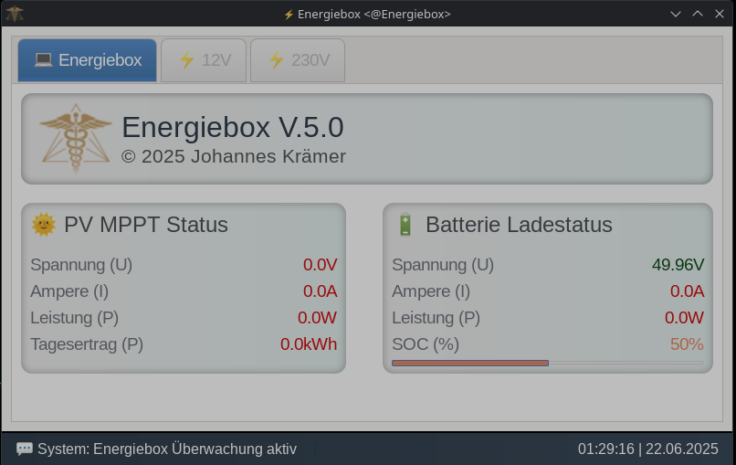
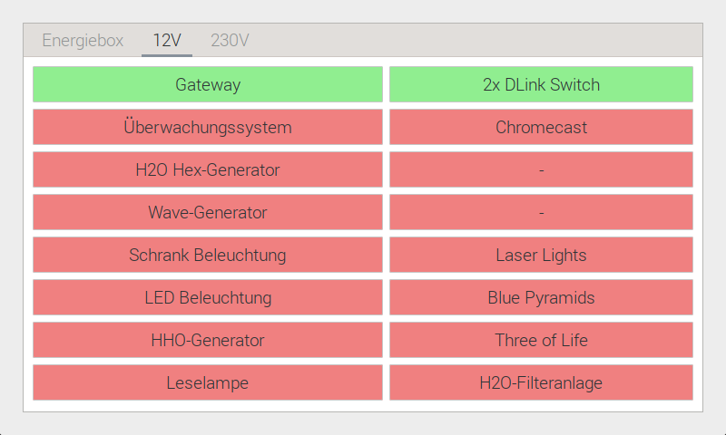
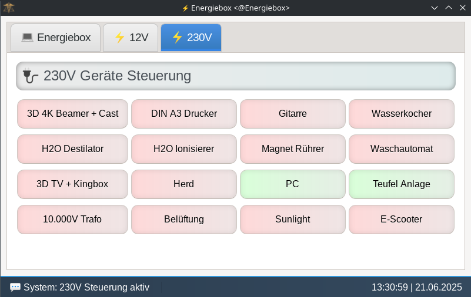
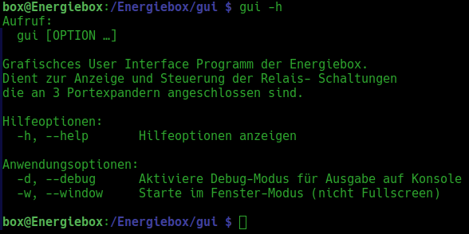

# Grafische Benutzeroberfläche & Status Monitoring

Dieses Programm stellt die grafische Benutzeroberfläche die bei dem booten der Energiebox gestartet wird, 
zur Verfügung. Die Anwendung ist für Touchdisplays (800x480) optimiert und läuft als Vollbild-GUI auf dem Raspberry Pi.

 
Das Programm beinhaltet 3 Tabs:    
Auf dem ersten Tab werden live MPPT Daten sowie Batterie- Ladedaten angezeigt.   
Diese Anzeige wird jede 3 Minuten aktualisiert.   
 
 
Tab Energiebox

 
    

  
Auf dem zweiten und dritten Tab wird jeweils eine Geräteliste für die jeweiligen Programme 
12V und 230V angezeigt.  
Ein roter Eintrag bedeutet das dieses Gerät derzeit ausgeschaltet 
ist und grün zeigt das dieses Gerät gerade mit Spannung versorgt wird und eingeschaltet ist.   
 
 
Tab 12V

 
    

 
Die Geräte können direkt von hier aus mit einem Tastendruck aus bzw. eingeschaltet werden wenn: 
 
<ul>
  <li>genügend Leistung zum Einschalten verfügbar ist</li>
  <li>die Relais Konfiguration einen Start aus der GUI erlaubt</li>
</ul>
 
Wenn z.B. in der Konfiguration von 230V eingetragen wurde, dass der 230 Volt Inverter 
eine Dauerleistung von 5000 Watt leistet und derzeit Geräte in der Liste aktiviert sind 
die mit einem Verbrauch von 4000 Watt eingetragen sind, dann kann in diesem Moment kein weiteres Gerät 
eingeschaltet werden welches mehr als 1000 Watt benötigt. In diesem Fall wird vom Programm 
eine Meldung ausgegeben die besagt das nicht genügend Leistung vorhanden ist. 
Um dieses Gerät trotzdem einzuschalten, müssen vorher andere Geräte ausgeschaltet werden! 
 
 
Tab 230V

 
    

  
Das Programm wird beim booten der Energiebox automatisch geladen und auf dem Display angezeigt. 
Es kann vom Raspberry aus lokal mit der Tastenkombination <code>ALT + F4</code> oder mit dem Befehl 
<code>kill -9 $(pidof gui)</code>geschlossen werden. 
 

## Fernsteuerung & System Monitoring über SSH: 

Falls eine SSH Verbindung zur Energiebox hergestellt ist, kann dieses Programm auch auf einem  
entfernten (Linux) Rechner aufgerufen werden. Dies ist nützlich für das Überwachen der 
MPPT & Batterie Daten. Die Relais können ebenfalls bedient werden! 

Um das Programm von einem entfernten Rechner zu starten, muss eine SSH Verbindung zur Energiebox 
hergestellt werden!  
Achtung: `X11Forwarding yes` muss auf der Energiebox aktiviert sein und der Client muss den ssh Befehl 
mit dem Parameter -X starten! Beispiel:

<code>ssh -X box@10.0.0.2</code> oder  
<code>ssh -X -p2222 box@home.cplusplus-development.de</code>

Nachdem diese Verbindung aufgebaut worden ist, muss zuerst sichergestellt werden. dass das Program <code>gui</code> 
nicht bereits lokal auf der Energiebox läuft. Um es vom entferntem Client zu beenden, kann der Befehl: 
 <code>kill -9 $(pidof gui) > /dev/null 2> /dev/null</code> 
 
genutzt werden. Um das Programm auf der Energiebox zu starten und über X11Forwarding auf dem Client PC 
anzuzeigen, kann der folgende Befehl genutzt werden: 
 
<code>gui --window</code> 
 

## 🔧 Programm Parameter

Bei falscher Benutzung der Programm Parameter wird eine Hilfe angezeigt. 
Hier kann eingesehen werden welche Parameter verfügbar sind und wozu sie genutzt werden!
 
 

 
    

