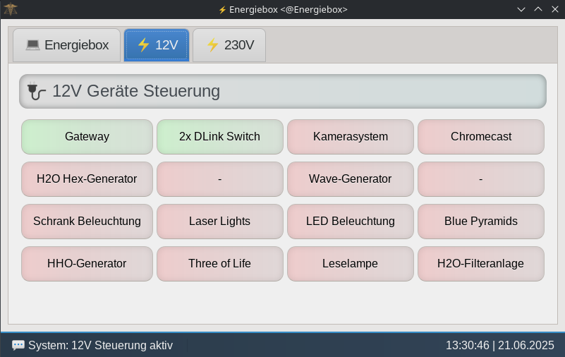

# gui Grafische Benutzeroberfläche 

Dieses Programm stellt die grafische Benutzeroberfläche die bei dem booten der Energiebox gestartet wird, zur Verfügung.
Die Anwendung ist für Touchdisplays (800x480) optimiert und läuft als Vollbild-GUI auf dem Raspberry Pi.
---
 
Das Programm beinhaltet 3 Tabs:    
Auf dem ersten Tab werden live PV- und Batteriedaten angezeigt.   
Diese Daten werden jede 3 Minuten aktualisiert.   
Hierzu wird die Datei <code>/Energiebox/Tracer/trace.txt</code> ausgelesen. 
 

 
    

  
Auf dem zweiten und dritten Tab wird jeweils eine Geräteliste für die jeweiligen Programme 
12V und 230V angezeigt.  
Ein roter Eintrag bedeutet das dieses Gerät derzeit ausgeschaltet 
ist und grün zeigt das dieses Gerät gerade mit Spannung versorgt wird und eingeschaltet ist.   
 
 
Tab 12V

 
    

 
Die Geräte können direkt von hier aus mit einem Tastendruck aus bzw. eingeschaltet werden wenn:  
<ul>
  <li>genügend Leistung zum Einschalten verfügbar ist</li>
  <li>die Relais Konfiguration einen Start aus der GUI erlaubt</li>
</ul>
 
Wenn z.B. in der Konfiguration von 230V eingetragen wurde, dass der 230 Volt Inverter 
eine Dauerleistung von 5000 Watt leistet und derzeit Geräte in der Liste aktiviert sind 
die mit 4000 Watt eingetragen sind, dann kann in diesem Moment kein weiteres Gerät 
eingeschaltet werden welches mehr als 1000 Watt benötigt. In diesem Fall wird vom Programm 
eine Meldung ausgegeben die besagt das nicht genügend Leistung vorhanden ist. 
Um dieses Gerät trotzdem einzuschalten, müssen vorher andere Geräte ausgeschaltet werden! 
 
 
Tab 230V

 
    

  

Eine grafische Steuerungsoberfläche für ein energieautarkes Smart Home-System auf Basis von Relaismodulen, Port-Expandern und einer Wasserstoff-/PV-Stromversorgung. 

## 🔧 Funktionen

- **Tab-basiertes Layout:**
  - **Energiebox:** Anzeige von PV- und Batteriedaten aus `trace.txt`
  - **12V:** Steuerung und Leistungsüberwachung von 12V-Geräten mit Leistungslimit
  - **230V:** Steuerung von 230V-Verbrauchern mit Gesamtleistungsgrenze

- **Automatische Aktualisierung:**
  - Relaisstatus wird alle 10 Sekunden aus `config.ini` aktualisiert
  - Aktualisierung der Beschriftung und Farbe der Buttons bei Änderungen
  - Tracer-Daten werden alle 3 Minuten neu geladen

