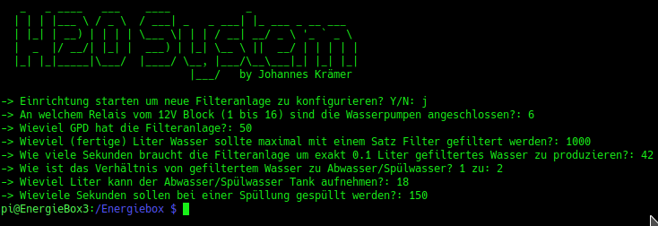
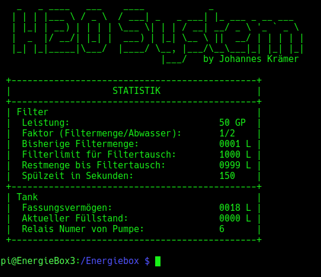
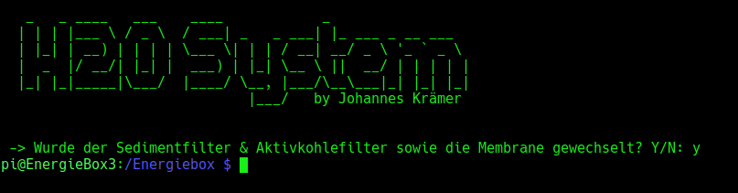
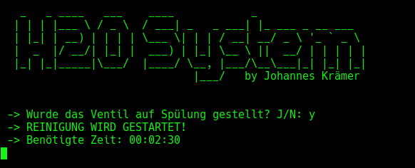
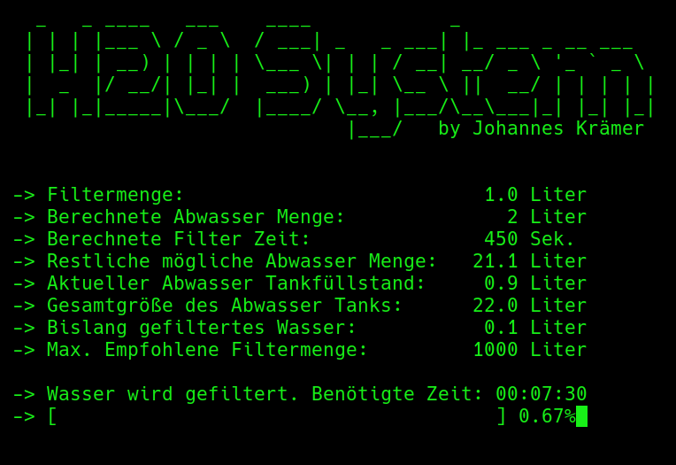

@Copyright by Johannes a.d.F. K r ä m e r

Was macht dieses Programm?

Dieses Programm dient zur Reinigung des Trinkwassers. Dabei wird Wasser aus einem Tank mit einer Pumpe sowie mit einer zusätzlichen Boosterpumpe
in eine Osmose Filteranlage mit 7 Bar gepumpt. Da Osmose Anlagen sehr langsam filtern, ist es immer sehr Zeitintensiv. Dieses Programm steuert 
den Filter und verhindert ein Überlaufen der Gefäße. Dabei wird die Benötigte Zeit beachtet sowie die Füllstände vom Abwassertank. Ebenso wird die Qualität
des Filters überwacht. Bei dem Programmaufruf wird eine genaue Literanzahl übergeben die dann gefiltert wird. 
Die Hilfe wird angezeigt wenn einfach nur <b>h2o</b> ohne Parameter aufgerufen wird.

 
    

Um eine Ordnungsgemäße Funktion zu garantieren, muss das Programm zuerst auf den verwendeten Filter konfiguriert werden. Zur Einrichtung wird das Programm
mit folgendem Parameter aufgerufen:

<b>h2o -setup</b>

 
    

Nun werden bestimmte Filtereigenschaften abgefragt. Diese werden benötigt damit das Programm die Berechnungen korrekt durchführen kann. Eine Statistik der vergangenen Nutzung kann
mit dem folgendem Befehl angezeigt werden:

<b>h2o -stats</b>

 
    

Wenn der Abwasser Tank geleert wird, muss das dem Programm mitgeteilt werden. Dies geschieht mit dem Befehl:

<b>h2o -empty</b>

 
    

Falls alle Filter ausgetauscht werden, wird dem Programm das mit folgendem Befehl mitgeteilt:

<b>h2o -change</b>

 
    

Wenn die gesamte Anlage durchgespült werden soll, kann das mit dem folgenden Befehl realisiert werden:

<b>h2o -clean</b>

 
    

Nun kommen wir zum eigentlichen Filtervorgang. Die Filterung kann in 100ml Schritten eingestellt werden. Für Kommastellen immer Punkte (kein , ) benutzen. Um 100ml zu filtern,
wird der Befehl 

<b>h2o -l 0.1</b>

genutzt. Wenn man dagegen 3 Liter filtern möchte, verwendet man:

<b>h2o -l 3</b>

 
    

Wenn z.B. der Abwasser Tank voll ist, wird das Filtern nicht gestartet.

