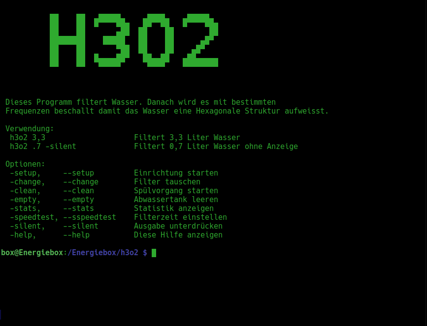
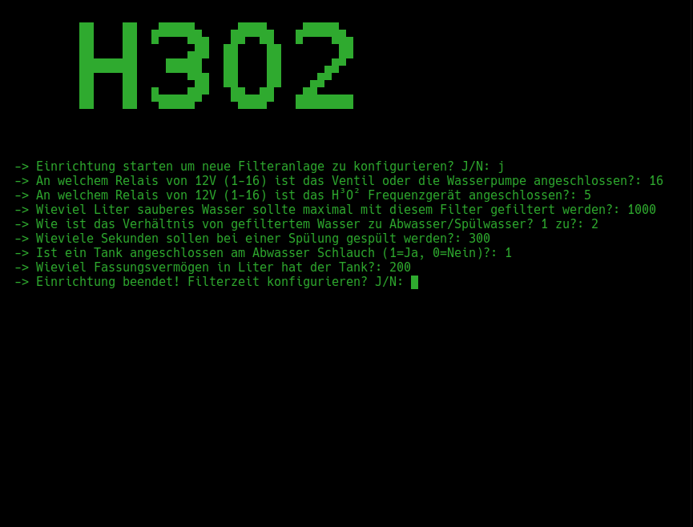
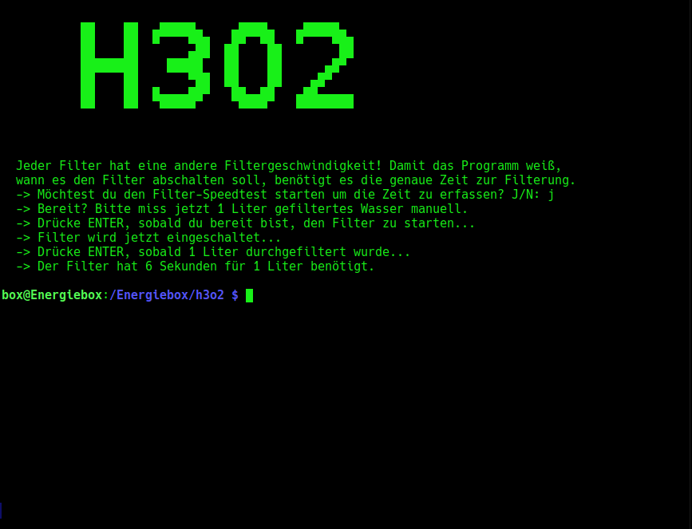
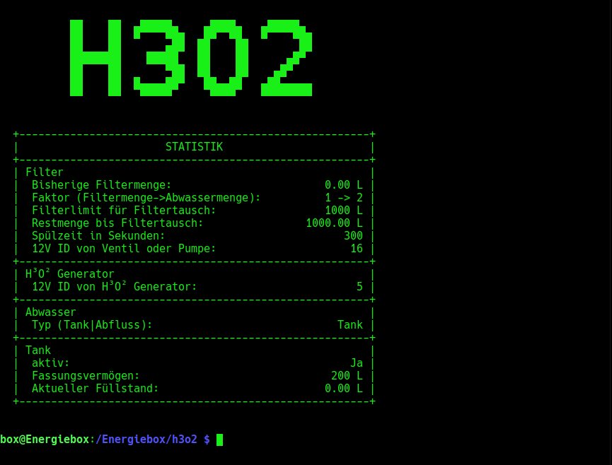
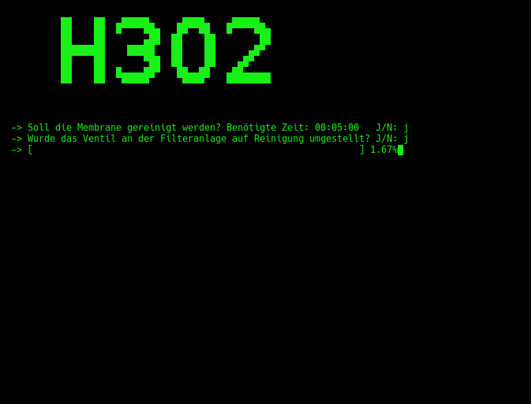
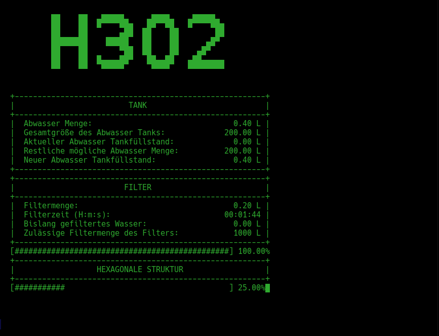

@Copyright by Johannes a.d.F. K r ä m e r

Was macht dieses Programm?

Dieses Programm dient zur Reinigung des Trinkwassers sowie zur Herstellung von strukturiertem Wasser. 
Dabei wird Wasser entweder aus einem Tank mit einer Pumpe und einer zusätzlichen Boosterpumpe
gepumt oder mit einem elektrischen Ventil an dem Hausanschluss entnommen. 

Da Osmose Anlagen sehr langsam filtern, ist es immer sehr Zeitintensiv. 
Dieses Programm steuert den Filter und verhindert ein Überlaufen der Gefäße. Dabei wird die Benötigte 
Zeit beachtet sowie die Füllstände vom Abwassertank überwacht. Ist kein Tank verfügbar, dann kann er
deaktiviert werden und das Abwasser fliesst in den normalen Abwasserkanal. 
Ebenso wird die Qualität des Filters überwacht. 
Nach der Filterung wird das gefilterte Wasser mit Frequenzen (Cellavital Optimierer) beschallt um eine 
Hexagonale Struktur im Wassser herzustellen.
Bei dem Programmaufruf wird eine genaue Literanzahl übergeben die dann gefiltert wird. 

Die Hilfe wird angezeigt wenn einfach nur <b>h3o2 -help</b> in der Konsole aufgerufen wird.

 
    

Um eine Ordnungsgemäße Funktion zu garantieren, muss das Programm zuerst auf den verwendeten Filter 
konfiguriert werden. Zur Einrichtung wird das Programm mit folgendem Parameter aufgerufen:

<b>h3o2 -setup</b>

 
    

Nun werden bestimmte Filtereigenschaften abgefragt. Diese werden benötigt damit das Programm die Berechnungen 
korrekt durchführen kann. Zu beachten ist folgendes: 

a) Das Ventil hat eine Spannung von 24 Volt anstelle von 12 Volt!

b) An dem Relais für den Generator liegt KEINE Spannung an. Es dient lediglich als Taster!

Am Ende des Setups kann gewählt werden ob die Filter- Zeiten erfasst werden sollen. Dieser Einrichtungsschritt
ist auch unter folgendem Befehl verfügbar:

<b>h3o2 -speedtest</b>

Osmose Anlagen werden immer mit z.B. 50, 75, 100 GPD (Gallonen pro Tag) beworben. GPD gibt an, wie viele 
Gallonen Wasser ein Filter innerhalb von 24 Stunden filtern kann. Ein GPD entspricht 3,785 Litern. 
Da Osmose Filter ausschliesslich mit Druck betrieben werden, ist dieser auch ausschlaggebend für die 
Filterleistung.

Da die Angaben abhängig vom Wasserdruck sind, kann mit dem Speedtest die exakte Filtermenge ermittelt werden.
Zur Einrichtung ist ein 1 Liter Messbecher notwendig! Das Programm fordert dazu auf, exakt einen Liter
zu filtern. Wenn dieser erreicht ist, muss die ENTER Taste gedrückt werden. Das Programm misst dabei einfach
nur die benötigte Zeit und berechnet die Ergebnisse auf alle späteren Filtervorgänge.

 
    

Eine Statistik der vergangenen Nutzung kann mit dem folgendem Befehl angezeigt werden:

<b>h3o2 -stats</b>

 
    

Falls ein Tank am Abwasser angeschlossen ist, muss dem Programm die Kapazität des Tanks 
mitgeteilt werden. Wenn der Abwasser Tank geleert wird, kann das dem Programm mit 
folgendem Befehl mitgeteilt werden:

<b>h3o2 -empty</b>

 
    

Falls alle Filter ausgetauscht werden, wird dem Programm das mit folgendem Befehl mitgeteilt:

<b>h3o2 -change</b>

 
    

Wenn die gesamte Anlage durchgespült werden soll, kann das mit dem folgenden Befehl realisiert werden:

<b>h3o2 -clean</b>

 
    

Nun kommen wir zum eigentlichen Filtervorgang. 
Die Filterung kann auf den Milliliter genau eingestellt werden. 
Es werden Angaben im Liter- Format erwartet. Um z.B. 100ml zu filtern,
kann folgendes eingegeben werden:

<b>h3o2 0.1</b> oder <b>h3o2 0,1</b> oder <b>h3o2 .1</b> oder <b>h3o2  ,1</b>

Wenn man dagegen 3 Liter filtern möchte, verwendet man:

<b>h3o2 3</b>

 
    

Wenn z.B. der Abwasser Tank voll ist, wird das Filtern nicht 
gestartet um ein Überlauf zu verhindern.

